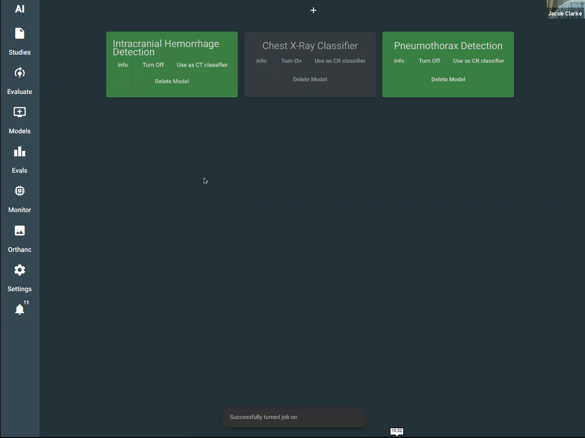
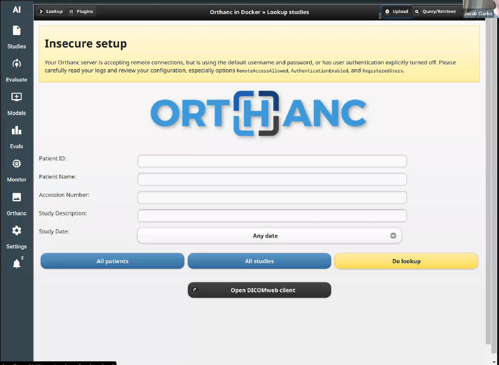
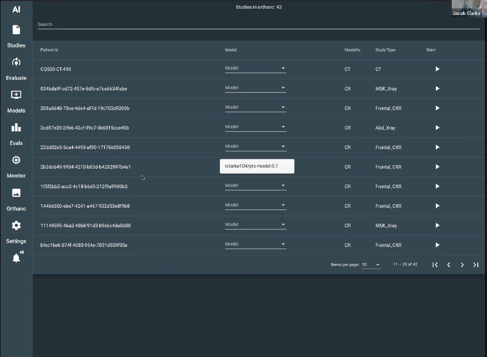
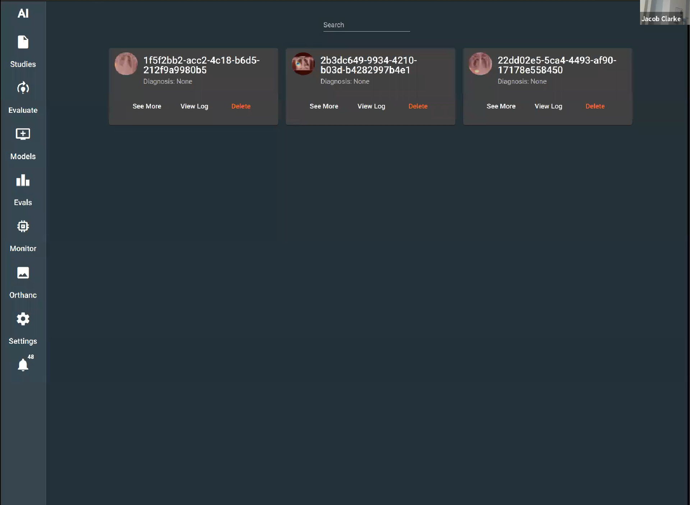
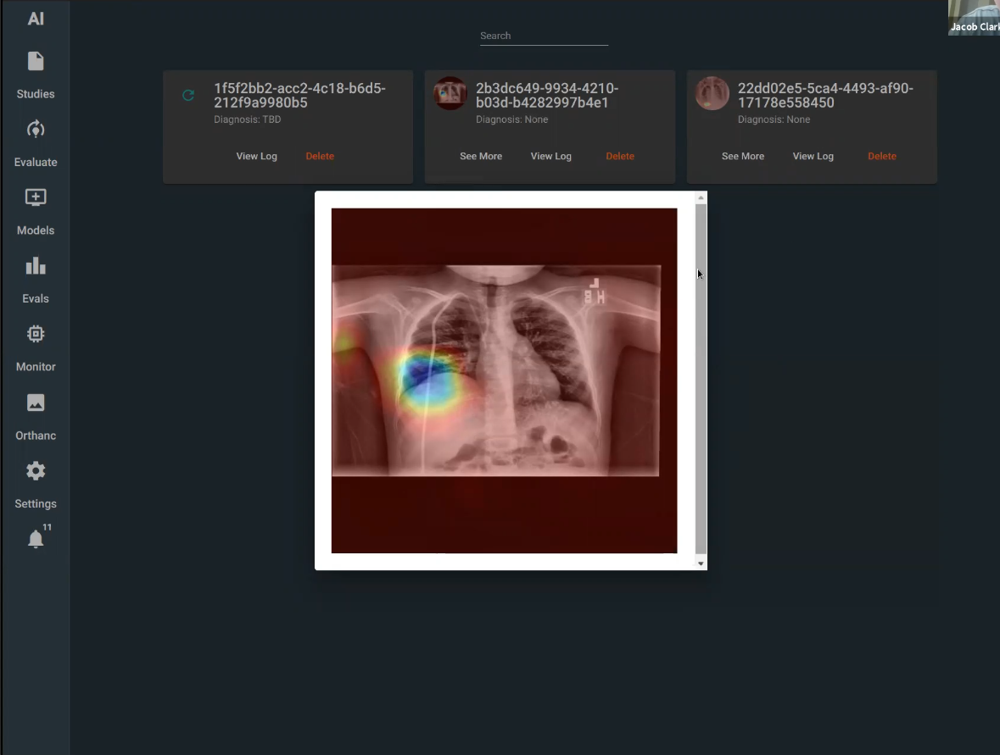
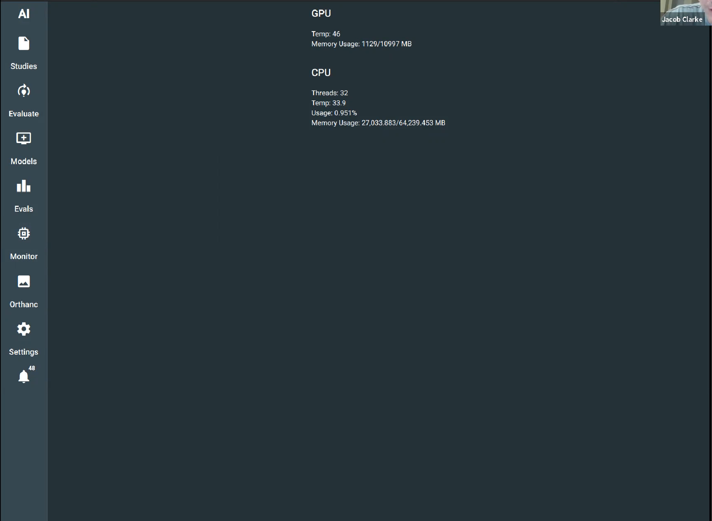

# Basic Usage

After following the instructrions outlined in [installation](/installation), you should have an active site running at [http://localhost:4200](http://localhost:4200).

## Workflow

When using the app you should use the following workflow:

1. Install and enable desired models in the [Models](#models) tab. All newly imported studies will automatically be evaluated by the enabled modules.
2. Navigate to the [Orthanc](#orthanc) tab and import desired studies as DICOM files.
3. View uploaded studies in the [Studies](#studies) tab. You can run one-off evaluations from this tab if desired.
4. View the results of model evaluations in the [Evals](#evals) tab.

## Models

## Orthanc

## Studies

## Evals

## Monitor

